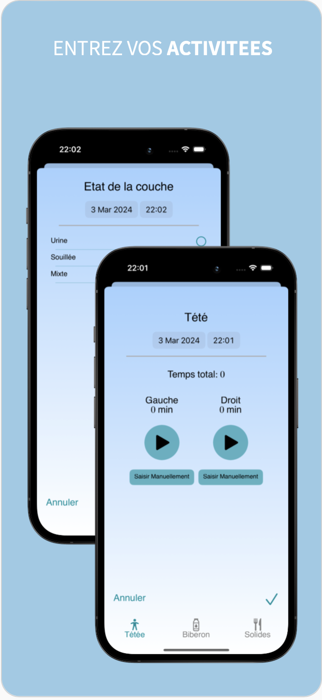
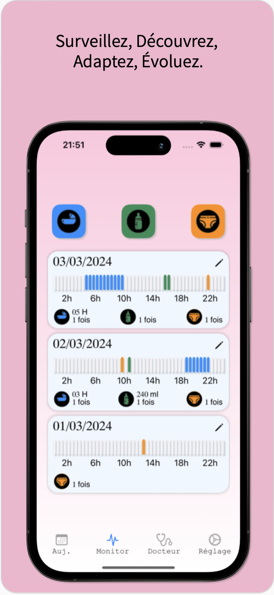

## MarmotMonitor
Marmot Monitor est une application dédiée aux parents, 
offrant un suivi complet des premières étapes de vie de leur enfant, 
de l'alimentation aux changements de couches, en passant par le suivi du poids.

<h3 align="center">     </h3>

L'accessibilité est importante pour nous ; l'application prend en charge le texte dynamique et VoiceOver.

Entièrement personnalisable, elle s'adapte à chaque famille, 
rendant la gestion du quotidien plus simple et rassurante. 

Avec Marmot Monitor, chaque moment important est enregistré, 
analysé et célébré, soutenant les parents dans cette belle aventure.

Compétences : Accessibility, SPM, CoreData, MVVM, Unit Test, UI Test

